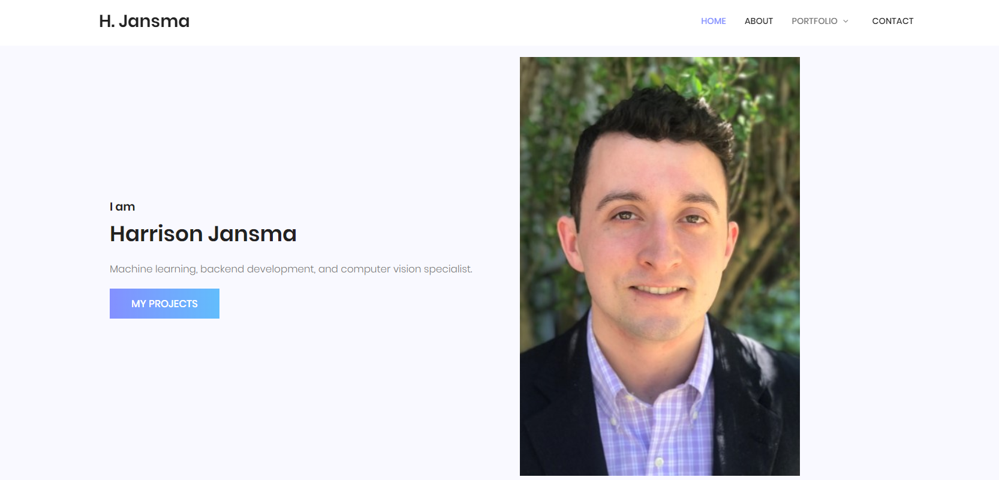
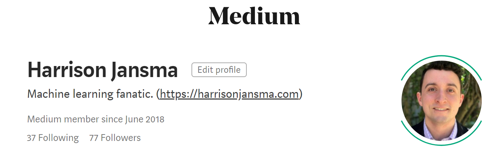
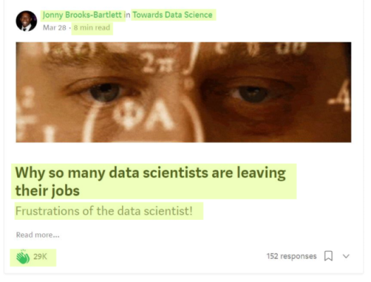
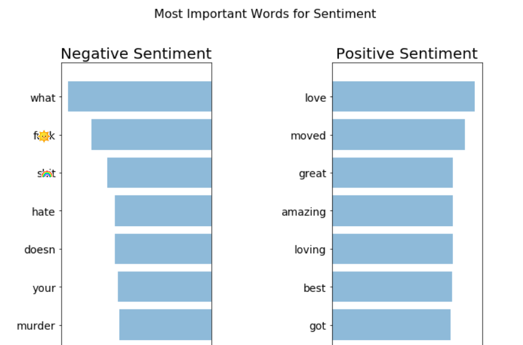
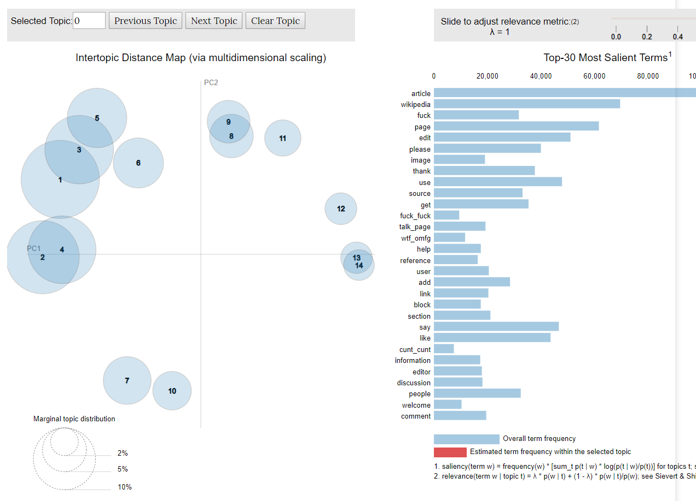
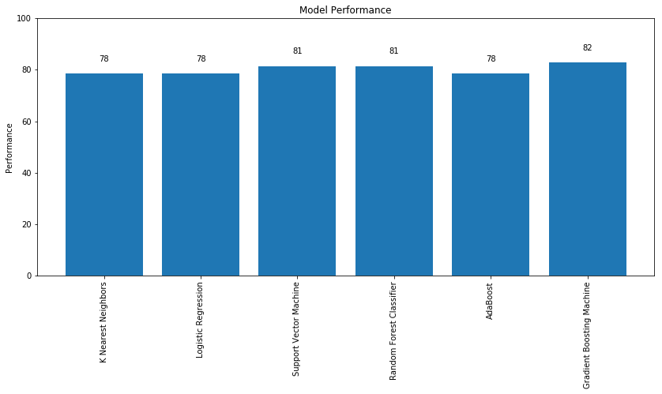

# A Self-Taught Data Scientist

  

  
Hi, my name is Harrison Jansma.

I am an avid FPS competitive gamer, sci-fi reader, and student. I love to learn about how things work, whether that be studying good coding practices, engineering techniques, or machine learning methods. Much of my experience revolves around building machine learning applications, but I also strive to gain a deeper understanding of the world so that I can expand my skillset and build new and amazing things.

# Get to Know Me 

### My Portfolio Website

  
  
 I built the site in HTML, CSS, and Javascript using pieces of an existing design on <a href="https://colorlib.com/">Colorlib</a>. Though I am not interested in Front-End Development, I created and deployed this website on a private <a href="https://www.digitalocean.com/">DigitalOcean</a> server so that I could learn more about web app design and back-end development. Though I did learn a lot from making this website, much of the joy that came from this project was found making something of my own and putting it out into the world.

  
  

  
### My Writing
  

  
  
  
  
I write because I love to teach. Though writing has fallen on my backburner with work and school, in the past I have been published in multiple major data-science and analytics publications; including <a href="https://medium.freecodecamp.org/@harrisonjansma">freeCodeCamp</a> (500k subscribers), <a href="https://towardsdatascience.com/@harrisonjansma">Towards Data Science</a>, and <a href="https://www.kdnuggets.com/2018/10/learn-data-science-broke.html">KDNuggets</a>..

### My Professional Experience
  

  
  
For the past 6 months I have been working as a Data Science Intern at Sprint. I was able to get much experience in database manipulation/extraction, ML model development, and business communication. Much of my work was centered around building machine learning applications to predict when business systems fail.

# My Past Projects

### [Scraping and Analyzing 1.4 Million Medium Stories](https://github.com/harrisonjansma/Analyzing_Medium)

Medium is a blogging platform where writers and readers share their ideas. This purpose of this project was to give Medium writers a benchmark to measure their own performance, as well as a goal that might increase the rankings of their stories in Medium's recommendation engine. With more than two hundred thousand writers in my dataset, this project has the potential to ease the creative process for thousands, and increase the quality of Medium's stories for its readers.
 

 

By collecting data on one million Medium stories, I was able to analyze the performance Medium's articles. As a result of this project, I found that the top 1% of Medium articles receive two thousand claps. Authors can use this metric as a goal when writing future stories. By achieving the top 1% of claps, a writer's story is more likely to stand out to Medium's recommendation engine, and as a result, reach new and diverse audiences.  

 
The results of my analysis, along with an extensive exploratory data analysis of Medium, can be found in <a href="https://github.com/harrisonjansma/Analyzing_Medium">this repository</a>.  
  
I also wrote a story detailing my findings in Medium's largest tech publication, freeCodeCamp (496k subscribers). The full article can be found <a href="https://medium.freecodecamp.org/how-i-analyzed-a-million-medium-articles-to-learn-how-many-claps-great-stories-get-d688cf92759f">here.</a> I then published the full data-set for public use by Medium's data-science community. All 1.4 million data points are freely available on Kaggle. My introductory article, describing the dataset and how I collected it, can be found <a href="https://towardsdatascience.com/i-just-published-a-massive-dataset-of-medium-stories-heres-the-link-to-get-it-889bab324138">here.</a> 

October 10, 2018

### [Experiment: Batch Norm vs. Dropout in ConvNets](https://github.com/harrisonjansma/Portfolio/blob/master/Experiment-BatchNorm-vs-Dropout/08-12-18%20Batch%20Norm%20vs%20Dropout.ipynb)

This experiment tests whether convolutional neural networks with dropout or batch normalization are more performant in image recognition tasks. The <a href="https://github.com/harrisonjansma/Portfolio/blob/master/Experiment-BatchNorm-vs-Dropout/08-12-18%20Batch%20Norm%20vs%20Dropout.ipynb">notebook</a> in this repository is experimental evidence supporting <a href="https://towardsdatascience.com/dont-use-dropout-in-convolutional-networks-81486c823c16">the Medium post</a> I wrote explaining how to more effectively build convolutional neural networks.

The above blog post has been published and <a href="https://towardsdatascience.com/weekly-selection-aug-17-2018-4ad31bfe7c37">featured</a> in Towards Data Science, with 3K reads on Medium in 2 weeks. It has also been reposted as a guest blog on KDNuggets, a leading site on Analytics, Big Data, Data Science, and Machine Learning, reaching over 500K unique visitors per month and over 230K subscribers/followers via email and social media. 

August 15, 2018

### [Global Average Pooling: Object Localization](https://www.harrisonjansma.com/GAP.html)

 
Object Localization Featuring my dog, Huckleberry.

In this project, I implemented the deep learning method for object localization (finding objects in an image) proposed in <a href="http://cnnlocalization.csail.mit.edu/Zhou_Learning_Deep_Features_CVPR_2016_paper.pdf">this research paper</a>. I improved code written by <a href="https://alexisbcook.github.io/2017/global-average-pooling-layers-for-object-localization/">Alexis Cook</a> to handle multi-class localization of images.

Computer vision has innumerable real-world applications. This project was my introduction to the world of computer vision research. Since the conclusion of this project, I have focused heavily on researching recent advances in convolutional neural network architectures. Furthermore, I have made an emphasis on learning how to apply these concepts using Tensorflow and Keras.

July 16, 2018

### [Apple Sentiment Analysis](https://www.harrisonjansma.com/apple.html)

This project was motivated by my drive to learn about the best practices of predictive modeling in text data. In <a href="https://www.harrisonjansma.com/apple.html">the write-up</a>, I cleaned and vectorized Twitter data, visualized and examined patterns, and created a linear classifier to predict document sentiment with 89% accuracy on a validation set.  

In the future, I would like to productionize this NLP model by creating a REST API to allow others access to my predictions.

June 20, 2018

### [Toxic Topic Modelling](https://www.harrisonjansma.com/toxic.html)

 In this project, I used unsupervised learning to cluster forum discussions. Specifically, I performed LDA clustering on Wikipedia forum comments to see if I could isolate clusters of toxic comments.(insults, slurs,...)

I was successful in isolating toxic comments into one group. Furthermore, I gained valuable knowledge about the discussions held within the forum dataset, labeling forum posts into nine distinct categories. These nine categories could be further grouped as either relevant discussion, side conversations, or outright toxic comments.  
 
June 13, 2018

### [Clustering Mental Health](https://www.harrisonjansma.com/Clustering.html)

In this write-up I sought to answer whether a survey of mental health benefits of tech industry employees could be used to cluster employees into groups with good and bad mental health coverage.

 By cleaning survey data and performing an exploratory data analysis I was able to analyze the demographics of the tech industry. I found the average respondent was a male, aged 35, located in the United States. By performing KMeans and agglomerative clustering (with scikit-learn) I attempted to cluster the data but found the survey setup prevented any meaningful insight into the data.

  
  
 In completing this project, I learned how to encode categorical data and create an insightful EDA with great visualizations. I also learned how to implement clustering methods on data, and <b> analyze the appropriateness of the clustering method with various techniques.</b> 

May 23, 2018

### [The End-To-End Data Science Lifecycle](http://www.harrisonjansma.com/Titanic.html)

In this write-up, I sought to practice the entire data science lifecycle. This includes defining project end goals, data cleaning, exploratory data analysis, model comparisons, and model tuning.

After a brief EDA, I visualized the Titanic dataset via a 2D projection. I then compared several machine learning algorithms and found the most accurate model to be a Gradient Boosted Machine. After a model tuning phase I increased model accuracy from 77% to 79%.

May 3, 2018

# Mini-Projects

- An Overview of Linear Models in Scikit Learn <a href="https://github.com/harrisonjansma/ML-Notes/blob/master/2.%20Sklearn%20Documentation/1.1-1.5%20Supervised%20Learning.ipynb">Jupyter Notebook</a>

- Web Scraping Overwatch Data from MasterOverwatch.com <a href="https://github.com/harrisonjansma/ML-Notes/blob/master/NLP/WebScrapeRegex/overwatch_web_scraping.ipynb">Jupyter Notebook</a>

- FICO Score Statistical Regression <a href="https://github.com/harrisonjansma/ML-Notes/blob/master/1.%20Shallow%20Learning%20Algorithms/1.%20Linear%20Regression/1_Linear%20Regression%20Code.ipynb">Jupyter Notebook</a>

