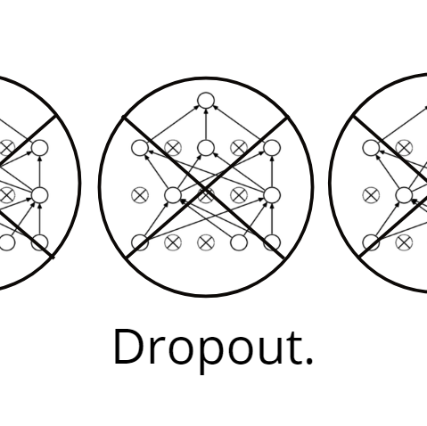
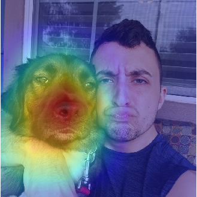

# Portfolio

## About Me

Hi, my name is Harrison Jansma.

I am a graduate student and researcher at the University of Texas at Dallas studying computer science. I am passionate about machine learning, computer vision, and web app development.	

I am a pragmatist at heart, I believe in the importance of applying machine learning to make a difference in the world. This means writing about my experiences as a self-taught Data Scientist as well as applying my models in real-world production systems.

To look my other social platforms, check out the following:

<ul>
<li>
  For a list of my projects and interests checkout my self-deployed website: https://www.harrisonjansma.com 

  
  <li>
  To read my blog posts about deep learning and data science (Which have been featured in Towards Data Science and KDNuggets): https://medium.com/@harrisonjansma
  
  <li>
  For a list of my professional qualifications look at my Linkedin: https://www.linkedin.com/in/harrisonjansma/
  </ul>

## My Work
The following are my personal projects. For a more complete (and aesthetically appealing) list of my work, please check out my <a href="https://www.harrisonjansma.com">portfolio website</a>. Which not only includes these projects, but also my Medium publications and computer vision (deep learning) research.

### [Experiment: Batch Norm vs. Dropout in ConvNets](https://github.com/harrisonjansma/Portfolio/blob/master/Experiment-BatchNorm-vs-Dropout/08-12-18%20Batch%20Norm%20vs%20Dropout.ipynb)

Tests whether convolutional neural networks with dropout or batch norm are more performant. The <a href="https://github.com/harrisonjansma/Portfolio/blob/master/Experiment-BatchNorm-vs-Dropout/08-12-18%20Batch%20Norm%20vs%20Dropout.ipynb">notebook</a> in this repository is experimental evidence supporting <a href="https://towardsdatascience.com/dont-use-dropout-in-convolutional-networks-81486c823c16">the Medium post</a> I wrote explaining how to more effectively build convolutional neural networks.. 
 
Published and <a href="https://towardsdatascience.com/weekly-selection-aug-17-2018-4ad31bfe7c37">Featured</a> in Towards Data Science, with 3K reads on Medium to date. Reposted as a guest blog on KDNuggets, a leading site on Analytics, Big Data, Data Science, and Machine Learning, reaching over 500K unique visitors per month and over 230K subscribers/followers via email and social media. 
August 15, 2018

### [Global Average Pooling: Object Localization](https://www.harrisonjansma.com/GAP.html)

Reimplementation of  global average pooling in convolutional neural networks for object localization proposed in <a href="http://cnnlocalization.csail.mit.edu/Zhou_Learning_Deep_Features_CVPR_2016_paper.pdf">this paper</a>. Improved code written by <a href="https://alexisbcook.github.io/2017/global-average-pooling-layers-for-object-localization/">Alexis Cook</a> to handle multi-class localization of images.
July 16, 2018

### [Apple Sentiment Analysis](https://www.harrisonjansma.com/apple.html)
An implementation of topics I covered while studying Natural Language Processing. In this write-up I cleaned and vectorized text data, visualized and examined pattern in the Twitter data, and created a linear classifier to prodict document sentiment w/ 89% accuracy on a validation set.  
 
I concluded the project by creating a write-up, which I posted on my website. In the future I would like to productionize this NLP model by creating a REST API to allow others access to my predictions.

June 20, 2018

### [Toxic Topic Modelling](https://www.harrisonjansma.com/toxic.html)
In this project I used word clouds and topic modelling to analyze a textual dataset. Specifically, I performed a LDA clustering analysis on wikipedia forum comments to see if I could isolate clusters of toxic comments.
 
I was largely succesful in isolating toxic comments into one group. I also gained valuable knowledge about the concepts and topics held within the forums, labeling forum posts into 9 distinct categories.  
June 13, 2018

### [Clustering Mental Health](https://www.harrisonjansma.com/Clustering.html)
A cluster analysis of survey responses from the tech industry.
May 23, 2018

