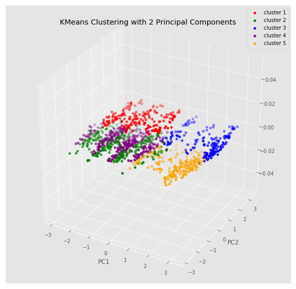

# Portfolio

## About Me

  

  
Hi, my name is Harrison.

I am a graduate student and researcher at the University of Texas at Dallas studying computer science. I am passionate about machine learning, computer vision, and web app development.	

I am a pragmatist at heart, I believe in the importance of applying machine learning to make a difference in the world. This means writing about my experiences as a self-taught Data Scientist as well as applying my models in real-world production systems.

To look my other social platforms, check out the following:

<ul>
<li>
  For a list of my projects and interests checkout my self-deployed website: https://www.harrisonjansma.com 

  
  <li>
  To read my blog posts about deep learning and data science (featured in Towards Data Science and KDNuggets): https://medium.com/@harrisonjansma
  
  <li>
  For a list of my professional qualifications check my Linkedin: https://www.linkedin.com/in/harrisonjansma/
  </ul>

## My Work
The following are my personal projects. For a more complete (and aesthetically appealing) list of my work, please check out my <a href="https://www.harrisonjansma.com">portfolio website</a>. Which not only includes these projects, but also my Medium publications and computer vision (deep learning) research.

### [Experiment: Batch Norm vs. Dropout in ConvNets](https://github.com/harrisonjansma/Portfolio/blob/master/Experiment-BatchNorm-vs-Dropout/08-12-18%20Batch%20Norm%20vs%20Dropout.ipynb)

An experiment testing whether convolutional neural networks with dropout or batch norm are more performant in image recognition tasks. The <a href="https://github.com/harrisonjansma/Portfolio/blob/master/Experiment-BatchNorm-vs-Dropout/08-12-18%20Batch%20Norm%20vs%20Dropout.ipynb">notebook</a> in this repository is experimental evidence supporting <a href="https://towardsdatascience.com/dont-use-dropout-in-convolutional-networks-81486c823c16">the Medium post</a> I wrote explaining how to more effectively build convolutional neural networks.    

The above blog post has been published and <a href="https://towardsdatascience.com/weekly-selection-aug-17-2018-4ad31bfe7c37">featured</a> in Towards Data Science, with 3K reads on Medium in 2 weeks. It has also been reposted as a guest blog on KDNuggets, a leading site on Analytics, Big Data, Data Science, and Machine Learning, reaching over 500K unique visitors per month and over 230K subscribers/followers via email and social media. 

August 15, 2018

### [Global Average Pooling: Object Localization](https://www.harrisonjansma.com/GAP.html)

Reimplementation of  global average pooling in convolutional neural networks for object localization proposed in <a href="http://cnnlocalization.csail.mit.edu/Zhou_Learning_Deep_Features_CVPR_2016_paper.pdf">this paper</a>. Improved code written by <a href="https://alexisbcook.github.io/2017/global-average-pooling-layers-for-object-localization/">Alexis Cook</a> to handle multi-class localization of images.

July 16, 2018

### [Apple Sentiment Analysis](https://www.harrisonjansma.com/apple.html)

An implementation of topics I covered while studying Natural Language Processing. In this write-up I cleaned and vectorized text data, visualized and examined pattern in the Twitter data, and created a linear classifier to predict document sentiment w/ 89% accuracy on a validation set.  

I concluded the project by creating a write-up, posted on <a href="https://www.harrisonjansma.com/apple.html">my website</a>. In the future, I would like to productionize this NLP model by creating a REST API to allow others access to my predictions.

June 20, 2018

### [Toxic Topic Modelling](https://www.harrisonjansma.com/toxic.html)

<b>The Purpose:</b> In this project I used word clouds and topic modelling to analyze a textual dataset. Specifically, I performed LDA clustering on wikipedia forum comments to see if I could isolate clusters of toxic comments.(insults, slurs,...)

I was largely succesful in isolating toxic comments into one group. Further, I gained valuable knowledge about the discussions held within the forum dataset, labeling forum posts into 9 distinct categories. I found each post could be catagorized as either relevant discussion, side conversations, or outright toxic comments.  
 
June 13, 2018

### [Clustering Mental Health](https://www.harrisonjansma.com/Clustering.html)

In this write-up I sought to answer whether a survey of mental health benefits of tech industry employees could be used to cluster employees into groups with good and bad mental health coverage.

 By cleaning survey data and performing an exploratory data analysis I was able to analyze the demographics of the tech industry. I found the the average respondent was a male, aged 35, located in the United States. By performing KMeans and agglomerative clustering (with scikit-learn) I attempted to cluster the data, but found the survey setup prevented any meaningful insight into the data.

  
  
 In completing this project, I learned how to encode categorical data and create an insightful EDA with great visualizations. I also learned how to implement clustering methods on data, and <b> analyze the appropriateness of the clustering method with various techniques.</b> 

May 23, 2018

